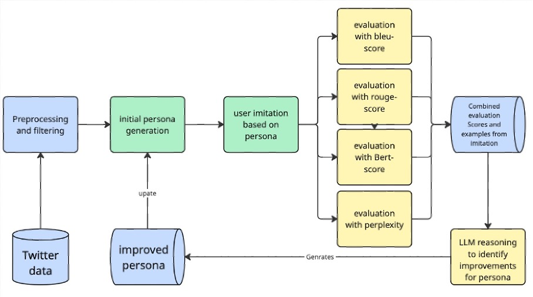
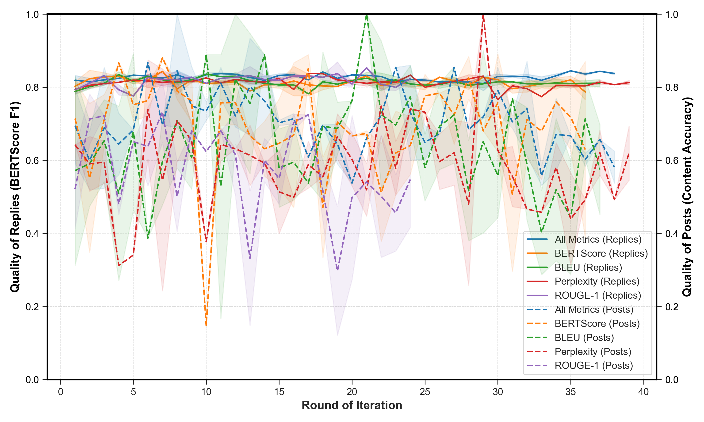
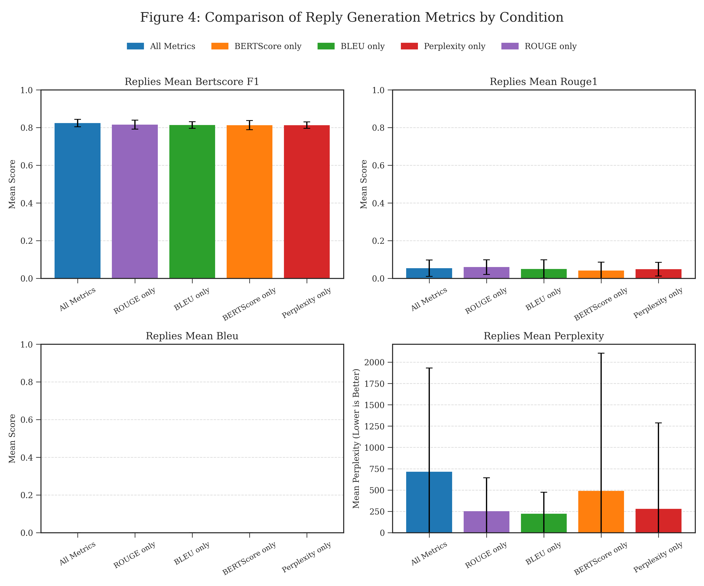
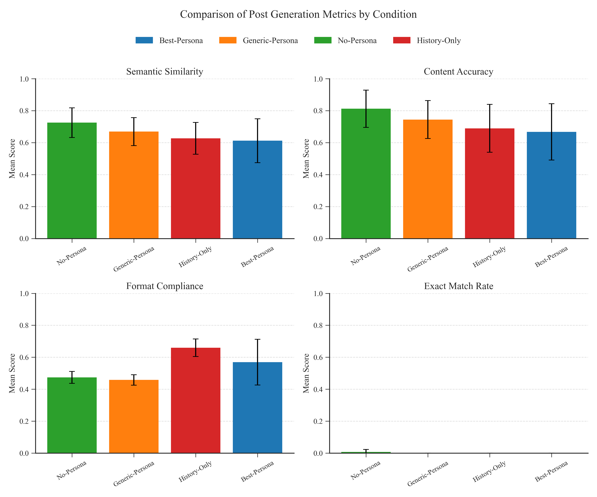

# MIMIC 

## MIMIC: Method for Imitating Media Interaction and Character

A framework for iterative persona optimization in Large Language Models using self-reflective prompt engineering for authentic social media user simulation.

## Overview

MIMIC is a research framework that investigates whether personas can achieve more authentic simulations through systematic self-reflection, without relying on complex fine-tuning methods. The system uses real social media data to create and iteratively optimize user personas for improved imitation quality.

## Research Question

Can an iterative, LLM-based optimization approach create improved personas that better approximate authentic individual communication patterns compared to static baseline approaches?

## Architecture



The framework consists of several key components:

1. **Data Preprocessing**: Twitter corpus filtering and user selection
2. **Initial Persona Generation**: LLM-based user profile creation from historical tweets
3. **Imitation Generation**: Persona-guided text generation for posts and replies
4. **Multi-metric Evaluation**: BLEU, ROUGE, BERTScore, and Content Accuracy assessment
5. **Self-Reflection**: LLM-based analysis of performance and persona improvement
6. **Iterative Optimization**: Continuous persona refinement over multiple rounds

## Key Features

- **Dynamic Persona Construction**: Uses continuous text rather than predefined categories
- **Task-Specific Processing**: Different approaches for post completion (masked word filling) vs. reply generation (full response)
- **Multi-Model Architecture**: Gemini-2.5-pro for persona tasks, Gemma-3-4b for generation
- **Comprehensive Evaluation**: Multiple metrics including semantic similarity and format adherence
- **Self-Optimizing Pipeline**: Automated persona improvement through reflection

## Dataset

- **Source**: Twitter/X platform data from TWON Project (August 2023)
- **Scale**: 7,790,741 posts filtered to 25 qualifying users
- **Criteria**: Minimum 100 posts and 50 replies per user
- **Language**: Primarily English, focused on US political discourse
- **Split**: History (persona creation) vs. Holdout (evaluation) datasets

## Results

### Iterative Optimization Performance

The framework demonstrates consistent performance improvements across all tested strategies:



**Post Completion Results:**
- Perplexity strategy: +0.3578 improvement (0.6422 → 1.0000)
- BLEU strategy: +0.4282 improvement (0.5718 → 1.0000)
- BERTScore strategy: +0.1667 improvement (0.7143 → 0.8810)

**Reply Generation Results:**
- ROUGE strategy: +0.0604 improvement (0.7929 → 0.8533)
- More stable improvements across all strategies
- Consistent moderate performance gains

### Baseline Comparison

Comparison against four baseline conditions revealed task-specific patterns:





**Unexpected Findings:**
- **No-Persona** achieved best performance in post completion tasks
- **Best-Persona** showed weakest performance despite optimization
- Reply generation showed no significant differences between strategies
- Format adherence varied considerably between approaches

## Implementation

### Core Components

```python
# Key modules
from main import run_experiment          # Main pipeline orchestration
from templates import format_template    # Prompt template management
from llm import call_ai                 # Multi-model LLM interface
from eval import evaluate_with_individual_scores  # Comprehensive evaluation
from saver import save_user_imitation   # Results persistence
from baseline_experiments import BaselineExperiment  # Comparative analysis
```

### Pipeline Configuration

```yaml
experiment:
  users_dict: "data/filtered_users"
  number_of_users: 24
  number_of_rounds: 100
  num_stimuli_to_process: 6

llm:
  persona_model: "google"      # Gemini-2.5-pro
  imitation_model: "ollama"    # Gemma-3-4b
  reflection_model: "google_json"
```

## Minimal Reproduction

### Prerequisites

```bash
pip install -r requirements.txt
python -m spacy download en_core_web_sm
```

### Environment Setup

```bash
export OPENAI_API_KEY="your-key-here"
export GOOGLE_API_KEY="your-key-here"
```

### Basic Usage

1. **Run Single User Experiment:**
```bash
python main.py --config config.yaml
```

2. **Run Baseline Comparison:**
```bash
python baseline_experiments.py --mode v2 --users 5
```

3. **Analyze Results:**
```bash
python round_analysis.py
python demo_analysis.py run_id_here
```

### Data Format

Expected JSONL structure per user:
```
Line 1: Historical tweets (persona generation)
Line 2: Holdout tweets (evaluation)
Line 3: Generated imitations
Line 4: Evaluation results
Line 5: Reflection and improvements
```

## Scientific Contributions

### 1. Iterative Persona Optimization
- Demonstrates feasibility of self-improving prompt systems
- Shows task-specific optimization patterns
- Provides framework for dynamic persona construction

### 2. Comprehensive Baseline Analysis
- **History-Only**: Tests raw data vs. LLM abstraction
- **Generic-Persona**: Evaluates minimal persona conditioning  
- **Best-Persona**: Validates optimization effectiveness
- **No-Persona**: Reveals task complexity interactions

### 3. Multi-Task Evaluation Framework
- **Post Completion**: Masked opinion word filling
- **Reply Generation**: Full response synthesis
- **Multi-Metric Assessment**: Beyond simple n-gram overlap

## Key Findings

1. **Iterative Optimization Works**: All strategies showed performance improvements
2. **Task Complexity Matters**: Simpler tasks benefited less from complex personas
3. **Stability vs. Performance**: Post completion showed dramatic but unstable gains
4. **Format Adherence**: Critical factor often overlooked in evaluation

## Limitations

- **Model Scale**: Smaller models may struggle with complex persona descriptions
- **Metric Limitations**: Current metrics approximate but don't capture full authenticity
- **Component Analysis**: Individual pipeline components require systematic evaluation
- **Resource Constraints**: Limited exploration of larger model combinations

## Repository Structure

```
MIMIC/
├── main.py                     # Core pipeline
├── baseline_experiments.py     # Comparative baselines
├── templates.py               # Prompt management
├── llm.py                     # Model interfaces
├── eval.py                    # Evaluation metrics
├── round_analysis.py          # Performance tracking
├── data_framework.py          # Data structures
├── results/
│   └── graphics/              # Performance visualizations
├── docs/                      # Documentation
├── test/                      # Test suites
└── preprocessing/             # Data preparation
```

## Citation

If you use this work, please cite:

```
Hau, C. (2025). MIMIC: Method for Imitating Media Interaction and Character
Natural Language Processing Seminar, University of Trier.
```

## Future Work

- Integration of dedicated authenticity metrics
- Systematic component analysis and ablation studies
- Extension to larger language models
- Cross-platform generalization studies
- Human evaluation of persona authenticity

## License

This project is developed for academic research purposes. Please see individual model and dataset licenses for usage restrictions.

---

